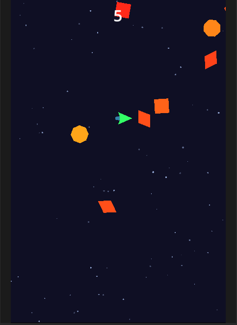
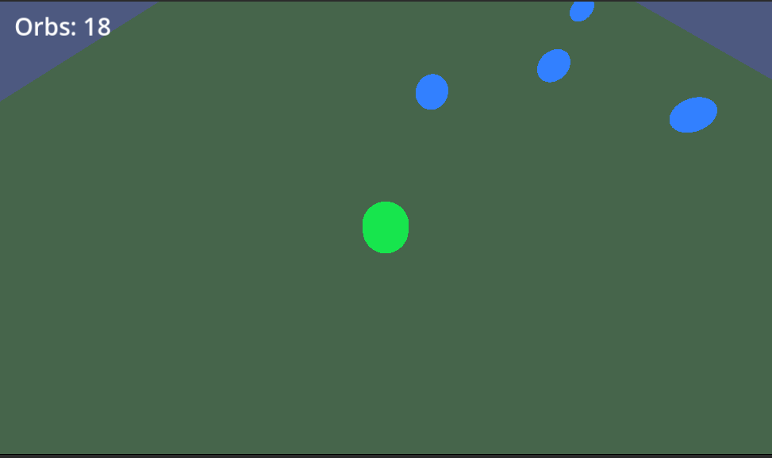

# Godot Game Development Portfolio

A collection of game projects built with **Godot 4.2**, demonstrating proficiency in GDScript, 2D and 3D game mechanics, scene composition, and engine fundamentals.

## Projects

### [Dodge the Creeps](./dodge-the-creeps/) — 2D Top-Down Survival Game

A fast-paced 2D survival game where the player dodges waves of randomly spawning enemies. Demonstrates 2D physics, procedural enemy generation, HUD/UI systems, input handling, and visual effects (starfield background, player trail).

<!-- Screenshot placeholder: replace with an actual screenshot -->

### [Orb Collector 3D](./orb-collector-3d/) — 3D Collection Game

A 3D game where the player navigates a platform to collect floating, bobbing orbs. Demonstrates 3D character control with smooth rotation, camera follow systems, signal-based architecture, procedural spawning, and scene lighting.

<!-- Screenshot placeholder: replace with an actual screenshot -->

## Technical Highlights

- **GDScript**: Idiomatic use of signals, exports, groups, `@export` annotations, and Godot lifecycle methods (`_ready`, `_process`, `_physics_process`)
- **Scene architecture**: Clean separation of scenes and scripts with signal-based communication between nodes
- **2D rendering**: Custom `_draw()` calls for procedural starfield and player motion trails
- **3D fundamentals**: `CharacterBody3D` movement, `Area3D` collision detection, `WorldEnvironment` lighting, unshaded materials
- **Procedural content**: Randomized enemy shapes/colors/spin, randomized orb spawn positions, edge-based enemy spawning

## How to Run

1. Install [Godot 4.2+](https://godotengine.org/download)
2. Clone this repository
3. Open Godot → Import → navigate to either project's `project.godot`
4. Press F5 to play

## Author

**Yuval Levental**
- M.S. Imaging Science, Rochester Institute of Technology
- B.S. Electrical Engineering, Michigan State University
- Background in computer vision, deep learning, and scientific visualization
