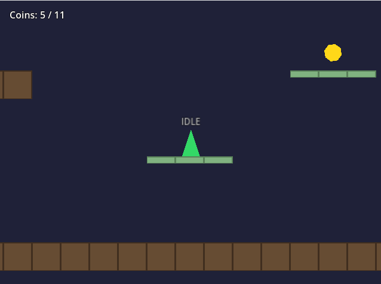

# Platformer 2D

A 2D platformer built in Godot 4.2 featuring an explicit finite state machine for player control and a procedurally built TileMap level defined as an ASCII string map.



## Gameplay

- Move with **A/D** or **arrow keys**
- Jump with **Space**, **W**, or **Up arrow**
- Hold a direction into a wall to **wall slide**, then jump to **wall jump**
- Collect all the gold coins scattered across the platforms
- Jump through **one-way platforms** (green) from below

## Architecture

```
scenes/
  Main.tscn      — Root scene: background, camera, HUD, player instance
  Player.tscn    — CharacterBody2D with polygon shape and state label
  Coin.tscn      — Area2D collectible with octagon polygon

scripts/
  Level.gd       — Builds level from ASCII map with StaticBody2D collision, spawns coins, camera follow
  Player.gd      — Movement controller with enum-based state machine
  Coin.gd        — Bobbing animation, spin, collection signal
```

## State Machine

The player controller uses an explicit **finite state machine** with five states:

```
         ┌──────────┐
    ┌───►│   IDLE   │◄──── on floor, no input
    │    └────┬─────┘
    │         │ input dir ≠ 0
    │         ▼
    │    ┌──────────┐
    ├───►│   RUN    │◄──── on floor, moving
    │    └────┬─────┘
    │         │ jump / left floor
    │         ▼
    │    ┌──────────┐
    │    │   JUMP   │◄──── velocity.y < 0 (ascending)
    │    └────┬─────┘
    │         │ velocity.y ≥ 0
    │         ▼
    │    ┌──────────┐
    ├────┤   FALL   │◄──── airborne, descending
    │    └────┬─────┘
    │         │ wall + holding toward wall
    │         ▼
    │    ┌──────────────┐
    └────┤  WALL_SLIDE  │ ── jump → wall jump (enters JUMP)
         └──────────────┘
```

Each state has a dedicated method (`_state_idle`, `_state_run`, etc.) that handles its own movement logic and transition conditions. State changes go through `_transition_to()` which runs exit/enter actions.

## Key Technical Details

- **Coyote time**: A brief grace period (80ms) after walking off a ledge where jumping is still allowed — prevents frustrating missed jumps
- **Jump buffering**: Jump inputs registered up to 100ms before landing are queued and executed on contact — makes the game feel responsive
- **Variable-height jump**: Releasing the jump button early cuts upward velocity by 50%, giving precise control over jump arc
- **Wall sliding and wall jumping**: Holding toward a wall while airborne enters a slow-fall wall slide state; jumping from a wall pushes the player away with a dedicated force vector
- **Squash and stretch**: Each state sets a target scale deformation (e.g., wide+short on landing, tall+thin on jumping) that lerps smoothly, adding juice with no sprite assets
- **ASCII level map**: The level layout is a readable string array in `Level.gd` — `#` for solid ground, `-` for one-way platforms, `C` for coins, `P` for player spawn
- **Procedural level geometry**: Each tile in the ASCII map generates a `StaticBody2D` with proper collision — solid `RectangleShape2D` for ground, `one_way_collision` for platforms — with `ColorRect` visuals layered on top
- **State label**: A small text label above the player displays the current state name in real time — useful for debugging and demonstrating the state machine

## Running

Open `project.godot` in Godot 4.2+ and press F5.
